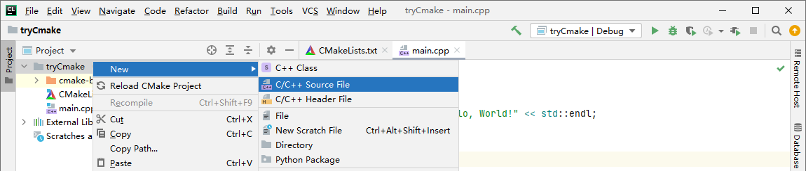
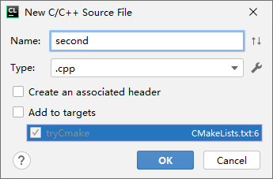
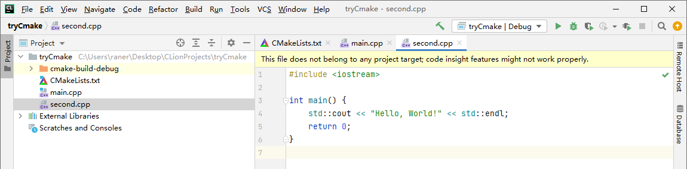
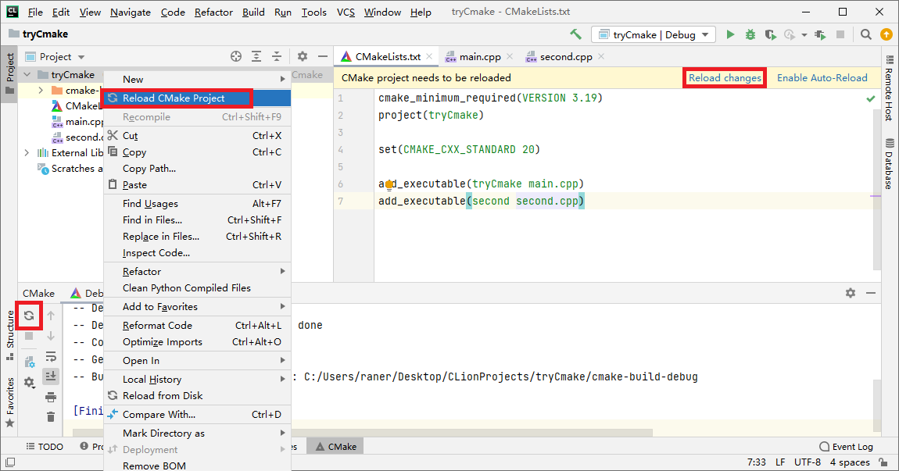
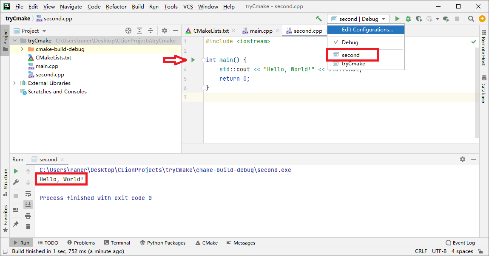
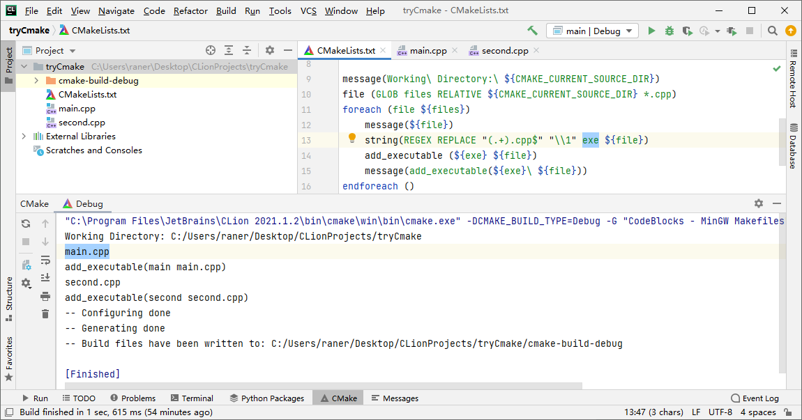

# CMake项目多个main函数

本文写于2021年12月14日，阅读时请注意时效。动笔时最新的CMake版本为3.22，为了防止最新文档内容发生变化，相关文档内容都使用了3.22的链接而没有用latest。

# 问题描述

使用`CLion`刷题的时候想要把每个题目的代码都放在同一个项目的不同源文件里，每个源文件中分别有一个`main`。

由于`CLion`使用的是`CMake`所以本文中的方法也适用于其他使用`CMake`的IDE，如：

- “CLion一个项目中多个main”

- “QT Creator一个项目中多个main”

这类的问题。实验设置和解决方法如下。项目文件可以在 [GitHub](https://github.com/ran-err/tryCmake) 下载，链接中的文件包含了所有注释和调试用的命令，文中为了突出重点删除了部分注释和调试用的代码。

# 实验设置

创建新项目，添加`second.cpp`，**不**选择`Add to targets`，在`second.cpp`中写一个简单的`main`，如下图。







# 方法1：手动添加每个新文件

在`CMakeList.txt`最后一行加入`add_executable(second second.cpp)`，之后选择`Reload CMake Project`，可以看到`second.cpp`中的`main()`已经可以单独运行和调试了。如下图。这个方法适用于文件不太多的情况，这种情况可以使用`Auto-Reload`。





# 方法2：自动添加文件

这个方法参考文末链接中的方案，我修改成了可读性更好的实现。原理是收集所有的`.cpp`文件然后使用循环为每个文件分别生成`add_executable(<name> <source>)`命令，代码如下，命令的含义都写在注释里了。这个方式适用于文件比较多的情况，但是**推测**由于`CMakeList.txt`没有修改所以不会触发`Auto-Reload`需要手动`Reload`。

```cmake
# 获取cpp文件相对于当前工作路径的相对路径，即文件名
# 工作路径${CMAKE_CURRENT_SOURCE_DIR}就是CMakeList.txt所在的文件夹
file (GLOB files RELATIVE ${CMAKE_CURRENT_SOURCE_DIR} *.cpp)
# 遍历每个文件名
foreach (file ${files})
    # 将去掉后缀的文件名存入exe变量（executable的缩写，不是代表.exe）
    string(REGEX REPLACE "(.+).cpp$" "\\1" exe ${file})
    # 分别生成add_executable(<name> <source>)命令
    add_executable (${exe} ${file})
endforeach ()
```

`Reload`结果如下图，带所有调试命令的代码可以从GitHub下载，运行结果与方法1相同。



如果需要多级目录，可以参考`CMake`文档中`file`命令的 [GLOB_RECURSE](https://cmake.org/cmake/help/v3.22/command/file.html#glob-recurse) 选项。

# 解决问题的思路

1. Google搜索“clion 多个main”，看了第一页的结果，溯源到了参考链接，代码能用但可读性不满意，而各处的文章似乎都是照搬解决方案，并没有讲命令的含义

2. 在CMake文档中使用自带的搜索定位到了`string`命令，位于[cmake-commands(7) CMake 3.22.1 Documentation](https://cmake.org/cmake/help/v3.22/manual/cmake-commands.7.html) ，在同一文档中找到了`file`命令，发现了`RELATIVE`选项

3. Google搜索“cmake当前目录”，发现了`CMAKE_CURRENT_SOURCE_DIR`变量，在[cmake-variable(7) CMake 3.22.1 Documentation](https://cmake.org/cmake/help/v3.22/manual/cmake-variables.7.html) 文档中发现了类似的`CMAKE_CURRENT_LIST_DIR`。重写代码和添加注释

4. Google搜索“cmake_current_source_dir vs cmake_current_list_dir”，发现CGold中关于[二者的对比](https://cgold.readthedocs.io/en/latest/tutorials/cmake-sources/common.html) 。二者有区别但是在本文的设置下二者是相同的，我又做了一些实验但是都没遇到二者不同的情况，考虑到只是为了刷题所以没有深究，如果有读者明白希望能不吝赐教。

参考链接：[my-leetcode-cpp/CMakeLists.txt at master · anonymouss/my-leetcode-cpp · GitHub](https://github.com/anonymouss/my-leetcode-cpp/blob/master/CMakeLists.txt)
